# 荣耀时刻

### 第六届中式八球公开赛颁奖仪式

在第六届中式八球公开赛决赛中，魏天昊3-1击败王翰墨成功卫冕，赛后由裁判姜星宇颁发冠军奖杯。（2024年12月3日于邱德拔体育馆）

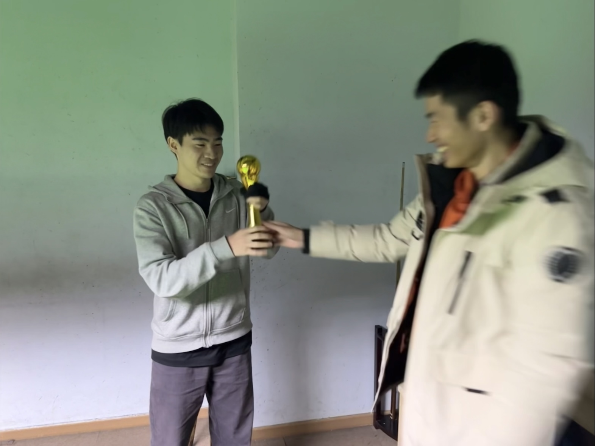

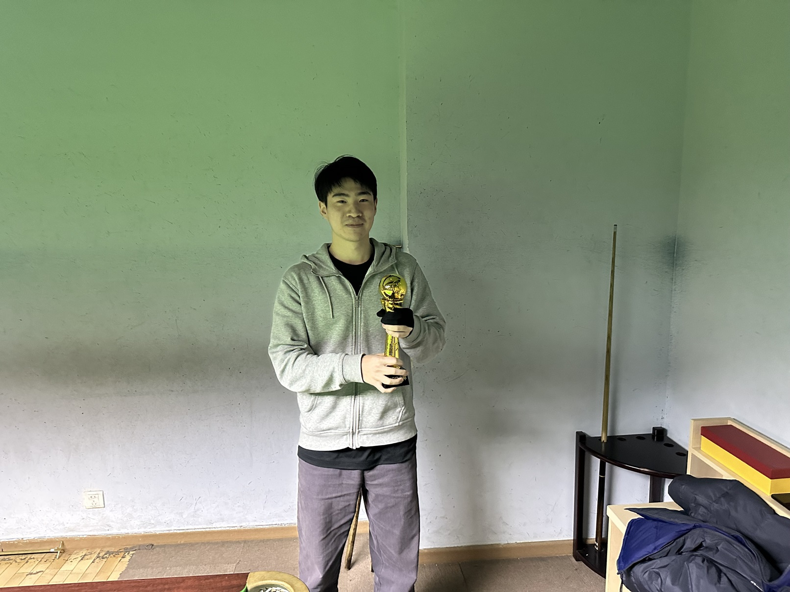

### 第七届中式八球公开赛颁奖仪式

在第七届中式八球公开赛决赛中，姜星宇3-0战胜初次进入决赛的郝明洋，成为第一位在公开赛决赛中完成横扫的选手，颁奖嘉宾为王翰墨。（2024年12月17日于小铁）

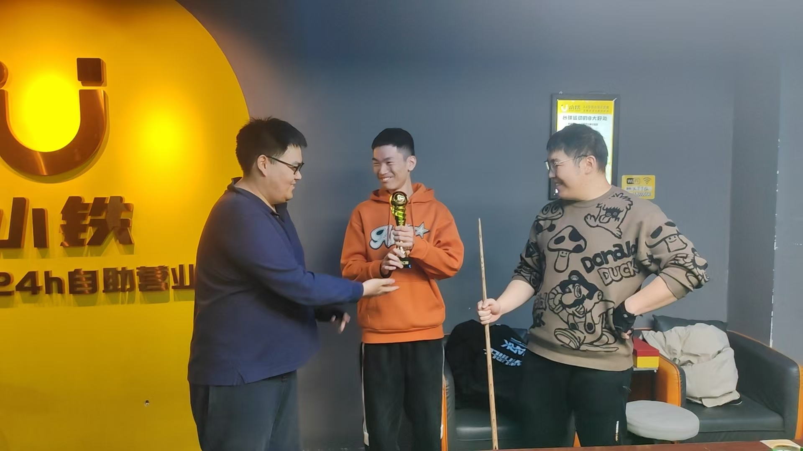

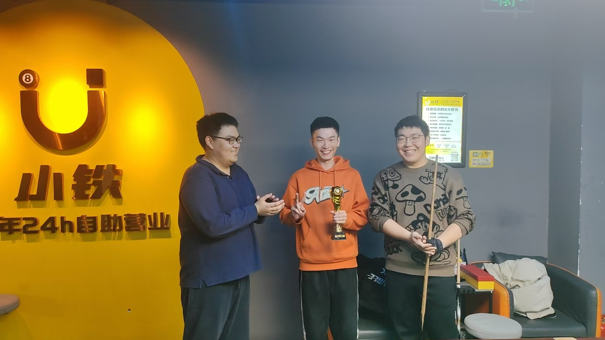

### 第八届中式八球公开赛颁奖仪式

在第八届中式八球公开赛决赛中，王翰墨3-1战胜姜星宇，赛后由对手姜星宇颁发奖杯并拍摄照片。（2024年12月25日于熊猫球社）

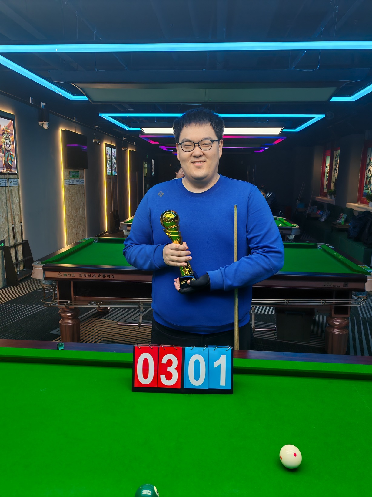

### 第九届中式八球公开赛颁奖仪式

在第九届中式八球公开赛决赛中，魏天昊3-0横扫王翰墨夺得冠军，颁奖嘉宾为郝明洋。（2025年1月6日于邱德拔体育馆）

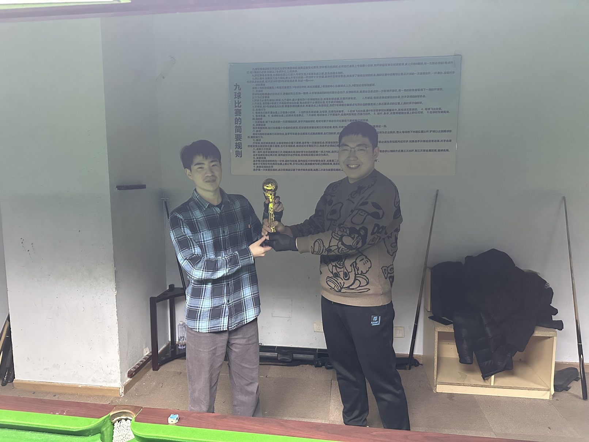

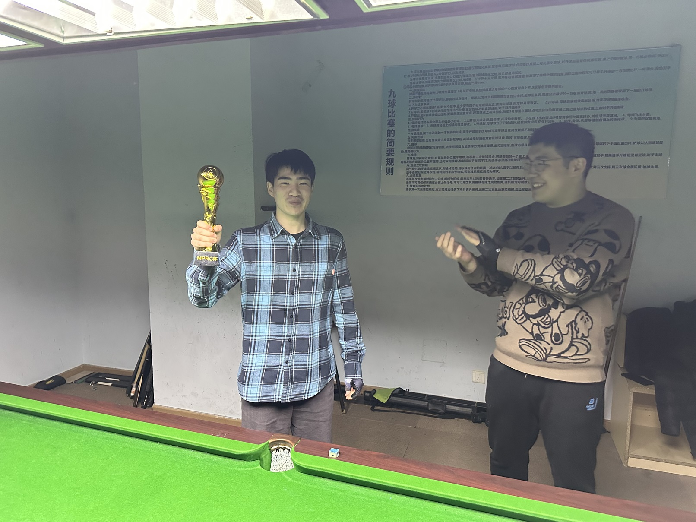

### 第一届MPRC台球锦标赛颁奖仪式

在第一届MPRC台球锦标赛总决赛中，王翰墨4-1战胜魏天昊，摘得桂冠，赛后由裁判姜星宇颁发MPRC杯。（2025年1月15日于熊猫球社）

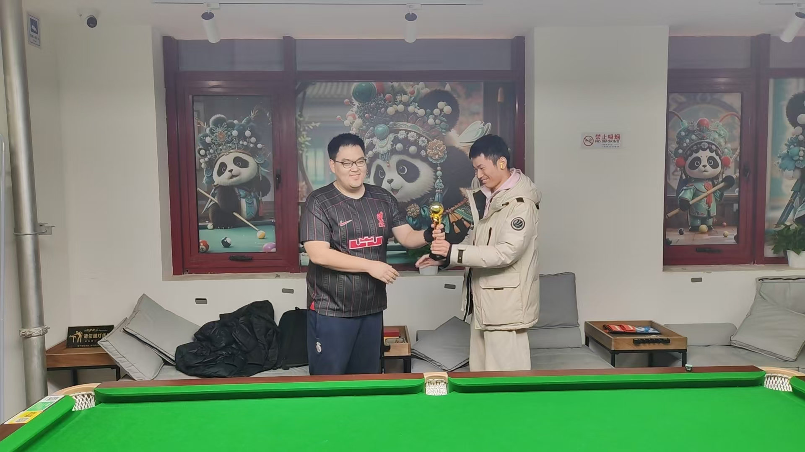

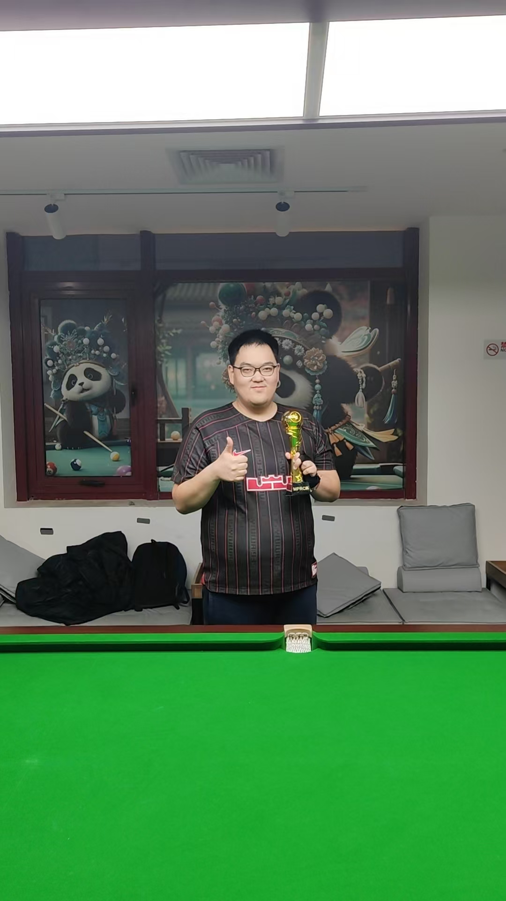

### 第十届中式八球公开赛颁奖仪式

在第十届中式八球公开赛决赛中，魏天昊3-1战胜王翰墨，卫冕成功，颁奖嘉宾为郝明洋。（2025年2月17日于邱德拔）

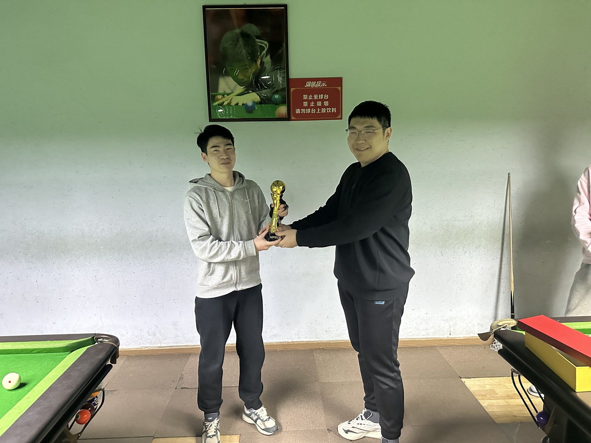

### 第十一届中式八球公开赛颁奖仪式

在第十一届中式八球公开赛决赛中，魏天昊3-1战胜姜星宇，达成史无前例的公开赛三连冠的壮举，颁奖嘉宾为王翰墨。（2025年3月3日于熊猫球社）

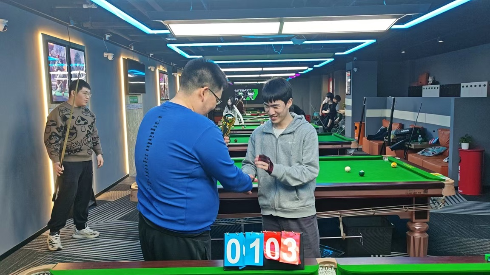

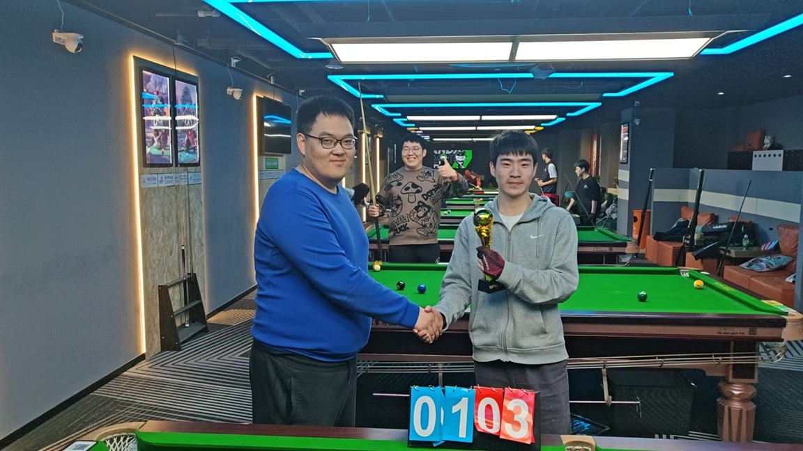