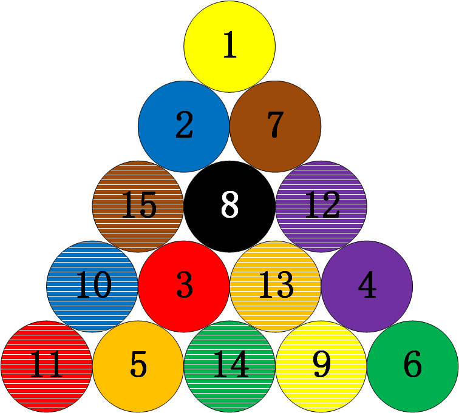

# 规则种类

## 主流玩法

### 斯诺克

斯诺克（英语：Snooker），是一种落袋式台球运动。此项运动使用的球台长12英尺、宽6英尺(即长3.6576米，宽1.8288米)。台面四个角落以及两边长边中心位置各有一个球洞。台面上的球分别为一个主球，15个红球以及6个彩色球（依分数顺序为黄、绿、啡、蓝、粉、黑）。

比赛过程中，球手需利用球杆通过击打主球碰撞红球或彩色球令其入袋。球手必须以击打红球作为每一杆的开始，若红球顺利入袋，球手可以击打任一彩色球获取分数，若彩色球亦顺利入袋，球手可再选择击打一枚红球，以此类推，直到台面上所有的红球及彩球都全部落袋。然后，球手必须以黄、绿、啡、蓝、粉、黑的顺序逐个把彩色球入袋，得分最高的球手获胜。若球手该杆不能将任何红球或彩色球击入袋中，或是主球入袋，则该杆结束，交由对手击球。

**父类：**英式台球

**子类：**

- 英式斯诺克
- 中式斯诺克

**变种：**

- 六红球斯诺克
- 十红球斯诺克

### 八球

八球（8-ball）是一种在有六个袋口的台球桌上进行的台球项目，使用台球杆和十六个台球（一个主球和十五个目标球）。目标球包括七个编号为1至7的实心球、七个编号为9至15的条纹球，以及黑色的8号球。在开球后，当某个玩家合法地将一颗目标球打入袋中时，他们将被分配为实心球或条纹球组。游戏的目标是在清除玩家所分配的球组后，将8号球合法地打入一个袋口。八球是世界范围内最流行的台球项目，通常被视为“台球”的代名词，有许多地区性的变种。

**父类：**普尔台球

**子类：**

- 美式八球
- 中式八球
- 英式八球
  
**亚型：**中式八球混合了美式八球的玩法和斯诺克的球桌，现在已经自成一派。

**变种：**

- 反向八球(Backward 8-Ball)

**版本：**英式八球规则的传统版本为WEPF Eight-Ball，另一个略有不同的版本为WPA Black-Ball（注意WPA Eight-Ball为美式八球）。

### 九球

九球（9-ball）是一种台球运动。它在一个长方形的台球桌上进行，四个角和每条长边的中间都有袋口。玩家使用台球杆击打白色主球，以按升序编号的方式将九个彩色台球打入袋中。首先打入9号球的玩家赢得比赛的胜利。九球的规则多种多样，衍生出了十球、七球和三球等游戏。

九球的比赛里，母球必须在碰撞到其他子球前，先撞击到台面上数字最小的子球（push-out可不依从此规定），否则就是犯规。依上述原则下，子球可不必依照号码顺序进袋，只要母球先碰击到号码最小的子球即可。因为不必指定子球落袋的袋口，若选手将9号球幸运地打进任何袋口，即赢得胜利，开球时也是如此。比赛时，选手在失误（注：没进球）、犯规之前，可持续出杆，若犯规，必须交由对手出杆，对手拥有“自由球”，可在出杆前，在台桌上自由摆放母球的位置以利进攻。

**父类：**普尔台球

**子类：**

- 美式九球
- 中式九球

**变种：**

- 七球
- 十球

## 小众而经典的其他玩法

### 开仑台球

开仑台球（Carom），也称法式台球，是一种球桌没有袋口的台球运动。开仑台球有多种竞赛方式，其共同点是使用台球杆来撞击母球，令其在台球桌上滚动并撞击其他球，以达成特定目的而得分。

早期的竞赛项目为四球竞赛与三球竞赛，两者规则一样，只是球数不同而已。选手击球后，只要令母球先后撞及两颗子球即可得分。后来因为发明了赛利撞法，让母球及两颗子球持续集中在一个小范围内，不断地撞击得分，因而创造惊人的高分，失去竞赛意义。

为了挽救开仑台球运动，于是各种改革方案因应而生：第一类是限制在某些区域内的击球次数，例如自由球竞赛及各种障碍线竞赛；第二类是额外要求母球或子球碰撞桌边（Cushion，音译“颗星”）以增加困难度，例如一颗星竞赛及目前最受重视的三颗星竞赛；第三类是规定母球或子球要通过球台上的特定位置，例如五针竞赛、九针竞赛等。

**子类：**

- 自由球
- 障碍线
- 一颗星
- 三颗星
- 五针
- 九针

### 俄式台球

俄式台球（Russian Pyramid），是一种落袋式台球，使用1颗红球，15颗编号为1至15的白球。球的直径68毫米，比花式台球的57毫米大了许多，也是所有台球运动尺寸最大者。正式比赛用球桌的大小，与斯诺克球桌相同，长12英尺、宽6英尺。但袋口非常小，只有1.1颗球宽。俄式台球由于使用最大的球桌、最小的袋口与最大颗的球，被认为是落袋式台球运动中，进球困难度最高的一种。

俄式台球有很多种不同的玩法，较常见的为自由（美）派、混合（莫斯科）派、动态（彼得堡）派三种赛制。不论上述何种赛制，开局前均将15颗号码球排列于三角框内。开球者撞击置于发球线的母球，令其撞开号码球堆。击球者不管打进母球或子球，都算得分，并可继续击球；否则换对手击球。一局比赛以率先打进8颗球者为胜，正规的比赛通常定为抢7局以上。

在自由派赛制里，开球后可用任意球当作母球，其余的就是子球。在混合派及动态派赛制里，红色是唯一的母球，因此红球进袋后，必须拾回并重新放回球台上，并由进球者指定移除台面上的一颗白球。两种赛制的差别是：混合派必须将拾回的母球放置于发球区，次一球只有进中袋及远方底袋才算得分；而动态派可将拾回的母球放置于球台上任何位置，但次一球母球进袋不算得分。

**子类：**

- 自由派
- 混合派
- 动态派

### 英式比利

英式比利台球（English Billiards）是一种结合开仑台球观念的落袋式台球，使用白色、黄色母球各一颗，及一颗红色子球，得分方式有：

- Cannon：母球先后碰撞另一颗母球及红球，不论次序：2分
- Potting：母球碰撞红球并令其进袋：3分；母球碰撞另一母球并令其进袋：2分
- In-off：母球先碰撞红球后本身进袋：3分；先碰撞另一母球或同时撞到红球与另一母球后本身进袋：2分

上述得分方式若同时发生，则可合并计分。

**父类：**英式台球

## 五花八门的普尔式玩法

### 直球（14-1连续击球）

直球（Straight Pool），也称为14-1连续击球，是一种台球运动，其中两名竞争玩家尝试在不犯规的情况下尽可能多地将目标球打入袋中。在直球游戏中，玩家可以声明并尝试将台面上的任何目标球打入袋中，无论其编号或颜色，直到只剩下一个目标球和主球，此时其余的十四个球会重新排列。此时，比赛恢复，目标是将剩下的球打入袋中，使主球反弹入重新排列的球中，散开球并允许玩家继续击球。目标是在比赛开始前商定的分数（通常为100分）内获胜。

打入目标球得1分，而所有犯规行为都将扣除1分，而球员如果连续三次犯规，则会被额外扣除15分。在开球时，要么母球和两个其他球必须碰到库边，要么必须有一个球被打入袋中。如果未能满足这两个条件中的任何一个，则视为犯规。首次开球犯规会受到罚2分的处罚。

**父类：**普尔台球

### 旋转台球（15球旋转/61）

旋转台球（Rotation Pool），有时也被称为15球旋转、61，是一种台球游戏，使用主球和一个摆放成三角形的15颗目标球，1号排在最前端，2号右下角，3号左下角，15号放中央，其余球不拘顺序。

比赛中，击球手必须始终优先用主球击打台面上编号最小的目标球，以尝试将目标球击入袋中得分。得分与击入袋中的目标球编号相对应。1号1分，2号2分，15号15分，以此类推，所有球合计120分。打进任何子球都算得分，间接打进其他子球也算分，但如果犯规将球打进则需将球从袋中拿出摆回桌上。比赛以分数加总较高者获胜，也即率先达到61分者获胜。

**父类：**普尔台球

### 单袋台球

单袋台球（One-Pocket Pool）是一种台球游戏，每位玩家只使用一个指定的口袋，玩家的目标是得分，得分的方式是将任何目标球打进他们的指定口袋，首先得分达到约定数目（通常为8分）的玩家获胜。玩家可以击打任何目标球，无论其颜色或号码。

犯规的惩罚是失去1分，已进袋的目标会被重新放置，且如果发生了母球落袋，则接下来的玩家可以将球放在台面顶部线后面，进行自由击打。三次连续犯规会判定为游戏结束。如果玩家将目标球打进除指定口袋外的其他口袋，则该目标球会被重新放置，并且该玩家的回合结束，除非该球也被打进了指定口袋。如果玩家将目标球打进对方的口袋，则该回合结束，对方得到1分。

**父类：**普尔台球

**村规：**双方各占一边的3个袋口，变为三袋台球。

### 翻袋台球

翻袋台球（Bank Pool）是一种独特的台球游戏，要求玩家必须通过让球撞击库边，然后滚入被指定的球袋来完成所有得分击球。初始台面共有九个目标球，目标是成为第一个成功地将任意顺序的五个球撞击库边并滚进球袋的玩家。在开局击球（即开球）时，至少要有四个球击中库边，否则视为非法开局。开局时落袋的球不计入得分，并且会在该玩家的回合结束后重新放回球桌。

翻袋台球不允许踢击（目标球必须先被母球直接击中，而不能先撞击库边）；不允许组合击球（击球必须从母球到目标球，然后目标球直接滚入被指定的球袋，并且击球者必须指定目标球和球袋）；目标球在前往球袋的途中不能撞击其他球（没有碰撞击球）。

**父类：**普尔台球

**村规：**每球得分为撞击库边的次数，撞击次数越多得分越高。

### 残酷台球

残酷台球（Cutthroat Pool）是一种通常在三人或三队之间进行的落袋式台球游戏，使用标准的全套台球（15个编号的目标球和一个母球）在台球桌上进行。每位玩家通常会被分配一组连续编号的五个目标球，1-5号球被称为“低”球，6-10号球为“中”球，11-15号球为“高”球，但球的数量会根据玩家人数而有所不同。

目标是成为最后一个在桌上至少剩下一个目标球的玩家。当玩家在桌上没有球时，他们就被称为“出局”，并且在玩家轮换中跳过他们的回合。只要玩家每次击球都能合法地将一个或多个目标球落袋，他们的回合就会继续。击球者甚至可以击入自己的球，以换取现在处于劣势的位置来继续回合。这种情况被称为“自毁前程”。

如果发生犯规情况，下一位击球者将获得球权。如果是将母球击入袋中或击出台面，击球者的所有对手都可以将自己已经落袋的一个球（如果有的话）拿出并放回桌上。因此，当任何仍在比赛中的玩家抓杆时，已经“出局”的玩家会重新参加比赛，他们的一个球会重新投入比赛。如果玩家在犯规时打进了对手的球，对手可以将该球从袋中取出并放回桌上。

**父类：**普尔台球

## 我们的村规玩法

### MPRC三人台球

MPRC三人台球是MPRC台球俱乐部自己的娱乐玩法，是一种八球的变体娱乐玩法，用于解决三个人无法一起打台球的问题。比赛由三人参加，轮流上场击球，详细规则经历了多个版本的变迁，主要有分组五球、三黑球、动态黑球、十六球这四个版本。通用的摆球方法如下：

**分组五球**

将15颗目标球分为三组，分别是1-5号球、6-10号球、11-15号球。每名选手在合法打进第一颗球后即选定该球所在的这一组球，目标是将这一组球全部打进袋中。比赛按照选手A、B、C顺序循环击球，率先打完自己组内所有球的选手为第一名，接下来由剩余两名选手继续击球，第二个打完自己组内所有球的选手为第二名，剩下的选手为第三名。

该玩法的缺陷是缺少八球玩法中的“黑球”，严格意义上并不属于八球玩法，因此必须做出改进。

**三黑球**

在分组五球的基础上，3号球、8号球、13号球分别为三个组的“黑球”，该“黑球”与八球玩法中的黑球作用相同。每名选手必须打进自己组内的其余四球，最后击打该组的“黑球”。若选手非法地将自己组的“黑球”打进，则直接丧失比赛资格并排在当前的最低名次，其选定组的将全部从台面上移除；若选手将其他组的“黑球”打进，则视为犯规并送给下家自由球，将打进的“黑球”重新摆放至置球点上。

**动态黑球**

在分组五球的基础上加入一颗动态“黑球”，即第一颗落袋的任意目标球。比赛从十五颗目标球开始，并仍然按照分组五球的规则分组。当任一选手打进一颗目标球后，该球即变为公共的“黑球”并摆回置球点。每名选手在打完自己组内的五颗球后，还需要再击打进“黑球”，第一个打进“黑球”的选手为第一名，然后将“黑球”摆回置球点，供剩余两名选手再争夺第二名。比赛时若非法地打进“黑球”，则直接丧失比赛资格并排在当前的最低名次。

**十六球**

使用额外一颗区别与十五颗目标球的球作为“黑球”，比赛开始时台面上共有16颗目标球，分别是三组球（每组五球）和一个公共“黑球”。公共“黑球”初始时摆放在球堆下方靠近底边的位置，其他规则与动态黑球一样。

### MPRC花式台球

MPRC花式台球要求通过非常规的方式将球打进袋中，比赛可以击打任意15个子球，每球1分，率先得到8分者获胜。非常规的方式要求不能以“球杆-母球-子球-球袋”的直接方式，在任意环节必须有其他子球或库边的介入，常见的方式如下：

- 组合球：母球撞击子球1，子球1撞击子球2，子球2入袋
- 借下：母球撞击子球1，子球1撞击子球2，子球1入袋
- 加农炮：母球撞击子球1，母球撞击子球2，子球2入袋
- 翻袋：母球撞击子球，子球撞击库边，子球入袋
- 宇式勾球：母球撞击库边，母球撞击子球，子球入袋