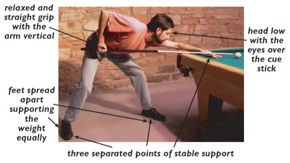
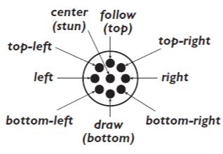

# 技术打法

## 基础

### 基本姿势与动作

> Alciatore, David G. The Illustrated Principles of Pool and Billiards. Union Square & Co., 2017.

### 9种常用手架

### 4种发力方式

> [Bilibili-BV1Nr42137gS](https://www.bilibili.com/video/BV1Nr42137gS)

## 击球准度

### 简单好用的瞄准法

> [Zhihu-19658895/16536895](https://www.zhihu.com/question/19658895/answer/16536895)

## 控球杆法

### 杆法及其击球点位

> Alciatore, David G. The Illustrated Principles of Pool and Billiards. Union Square & Co., 2017.

### 杆法演示

高杆：[BV1oEDsYeEQ3](https://www.bilibili.com/video/BV1oEDsYeEQ3)

低杆：[BV1oEDsYeESh](https://www.bilibili.com/video/BV1oEDsYeESh)

### 加塞打不准的两个因素

> [Bilibili-BV1qcqzYKELz](https://www.bilibili.com/video/BV1qcqzYKELz)

### 【Dr.Dave台球教程】扎杆教程-科里奥利瞄准法则

> [Bilibili-BV1na4y1R7Tj](https://www.bilibili.com/video/BV1na4y1R7Tj)

## 理论

### 投掷效应和齿轮效应

投掷效应（Throw Effect）指的是在击球时，球杆击打白球的某个点，使得白球在接触目标球时会发生偏移。这种偏移主要是由于击球时施加的侧旋和撞击角度的影响。投掷效应会导致目标球的轨迹偏离预期，通常是在击球时用侧旋来改变白球的路径。投掷效应可进一步细分为撞击产生的CIT(Cut Induced Throw)和旋转产生的SIT(Spin Induced Throw)。

齿轮效应（Swerve Effect）是指当白球与目标球碰撞时，由于球的转动和碰撞的角度，目标球的路径会受到影响，导致其产生旋转和偏移。齿轮效应主要体现在击球的力量和旋转的作用上，使得目标球在击出后有一个预期之外的轨迹。

### 台球动力学

> [Zhihu-487265175](https://zhuanlan.zhihu.com/p/487265175)

## 各种技巧

### 半贴库怎么提高进球率

> [Bilibili-BV1BE421K7ic](https://www.bilibili.com/video/BV1BE421K7ic)

### 【Dr.Dave台球教程】 2x+1/3翻袋法则

> [Bilibili-BV14q4y1V7wy](https://www.bilibili.com/video/BV14q4y1V7wy)

### 【Dr.Dave台球教程】 跳球最全攻略！

> [Bilibili-BV1KR4y157Z8](https://www.bilibili.com/video/BV1KR4y157Z8) 

### 新手怎么开球

> [Bilibili-BV1f4421Z7wY](https://www.bilibili.com/video/BV1f4421Z7wY)

### 【Dr.Dave台球教程】十个避免连击的方法

> [Bilibili-BV13T4y1v71F](https://www.bilibili.com/video/BV13T4y1v71F)

## 思路

### 新手涨球必练《半台456》

> [Bilibili-BV1H915YAEU1](https://www.bilibili.com/video/BV1H915YAEU1)
