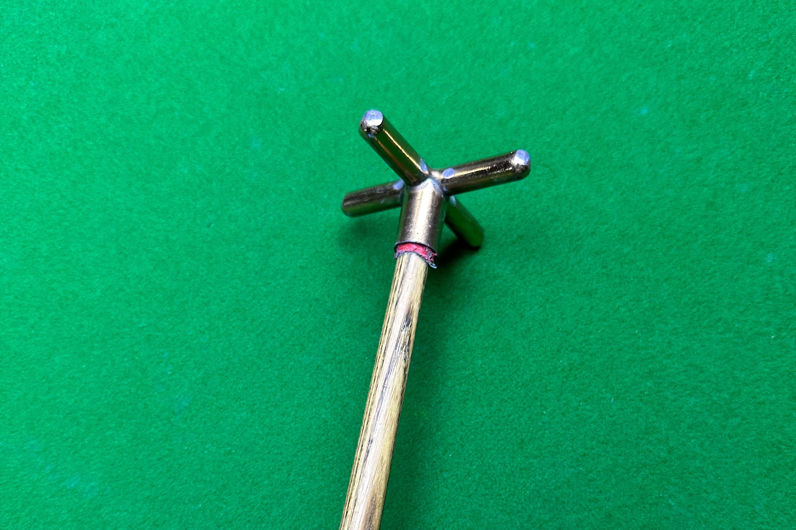

# 装备器材

## 球杆

### 杆头

- 小头杆：9mm-11.5mm
- 大头杆：11.5mm-14mm

### 用途

- 打杆：用于常规击球，通常长度适中、重量平衡
- 冲杆：用于开球，头部通常较硬，直径更大，便于发挥更大的击球力量
- 跳杆：用于跳球，材质硬度更高，直径略大或与普通杆头相近，球杆长度较短

### 材料

- 木质杆：一般用时白蜡木或枫木制作的传统球杆，白蜡木材质更常见于小头杆，优点是硬度高、远距离击球更稳定；大头杆采用枫木材质更多，木质偏软,对力度和技巧的展现效果更充分
- 碳纤维杆：一种使用碳纤维材料制作的台球杆，与传统的木质球杆相比，它具有轻量化、高强度和稳定性等特点

## 球桌

### 中式球桌

主流品牌：

- 星牌台球桌
- 乔氏台球桌
- 来力台球桌
- 独牙台球桌

### 美式球桌

### 斯诺克球桌

## 用球

### 中式八球

### 英式斯诺克

### 中式斯诺克

### 美式八球

## 其他

### 架杆

### 手套

### 巧克粉

### 摆球器

### 加长把

