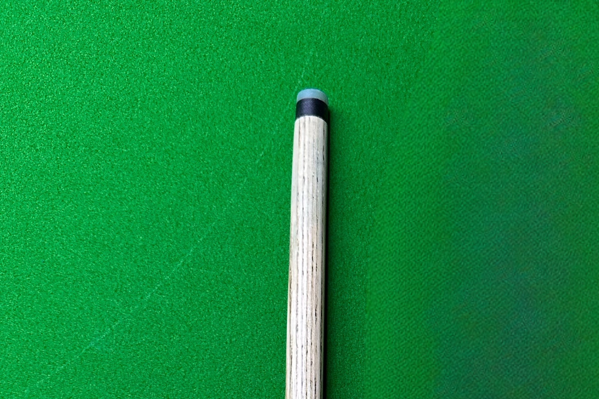
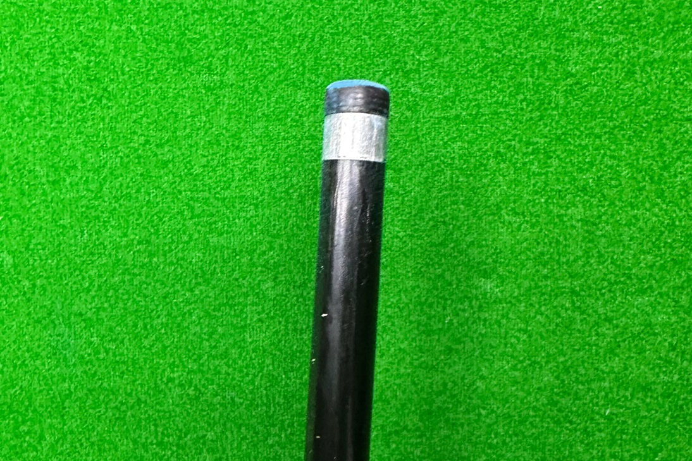

# 装备器材

## 球杆

### 基础球杆

- 小头杆：9mm-11.5mm
- 大头杆：11.5mm-13mm

### 特殊用途球杆

- 冲杆：用于开球，头部通常较硬，直径更大，便于发挥更大的击球力量
- 跳杆：用于跳球，材质硬度更高，直径略大或与普通杆头相近，球杆长度较短

### 其他材料球杆

碳纤维杆是一种使用碳纤维材料制作的台球杆，与传统的木质球杆相比，它具有轻量化、高强度和稳定性等特点。

## 球桌

### 中式球桌

主流品牌：

- 星牌台球桌
- 乔氏台球桌
- 来力台球桌

### 美式球桌

### 斯诺克球桌

## 用球

### 中式八球

### 英式斯诺克

### 中式斯诺克

### 美式八球

## 其他

### 架杆

### 手套

### 巧克粉

### 摆球器

