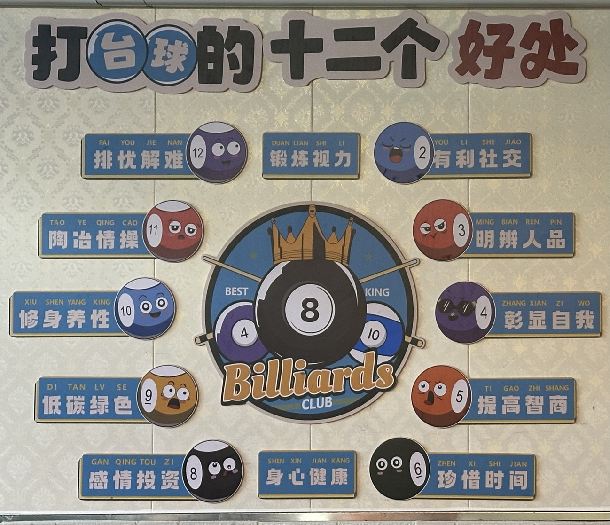
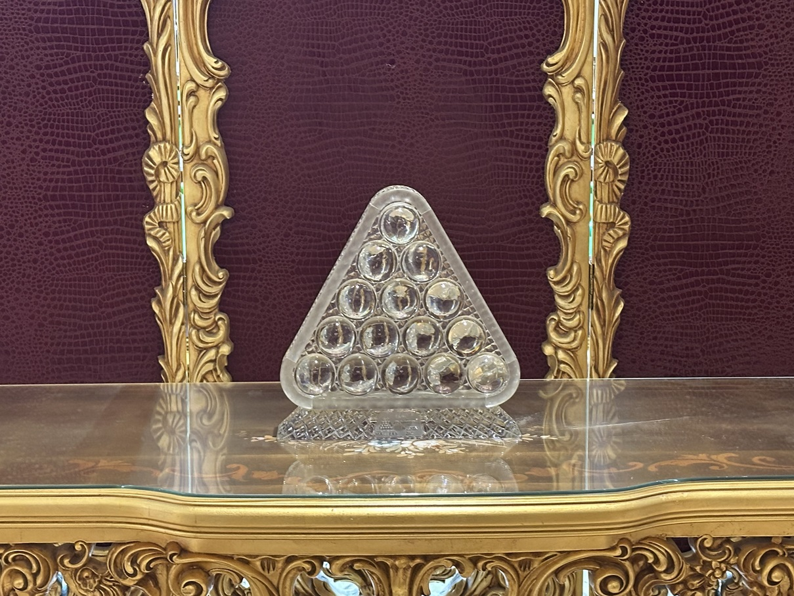

# 拓展信息

### 观赛

斯诺克职业比赛的最新动态可在[WST.TV](https://www.wst.tv/matches/)上查看。

### 游戏

台球电子游戏推荐制作精良的[Pro Snooker](https://play.google.com/store/apps/details?id=com.iwaredesigns.prosnooker2012)和[Pro Pool](https://play.google.com/store/apps/details?id=com.iwaredesigns.propool2012)。

### 书籍

台球基础理论及教学书籍：

> Alciatore D G. The illustrated principles of pool and billiards[M]. Union Square & Co., 2017.

### 博主

B站up主推荐：

- [热爱台球的赵赵](https://space.bilibili.com/3493290970188184)
- [是刘桂莲啊](https://space.bilibili.com/483547140)

## 圣地

克鲁斯堡剧院（Crucible Theatre）是斯诺克世锦赛的举办地，位于[55 Norfolk Street, Sheffield, S1 1DA, England, UK](https://www.google.com/maps/@53.3809863,-1.4674374,19z)。

## 好处

*\*图片来自名仕自助台球*

## 奖杯

*\*图片为斯诺克大师赛奖杯，位于CBSA世界斯诺克学院（利骏台球俱乐部）*