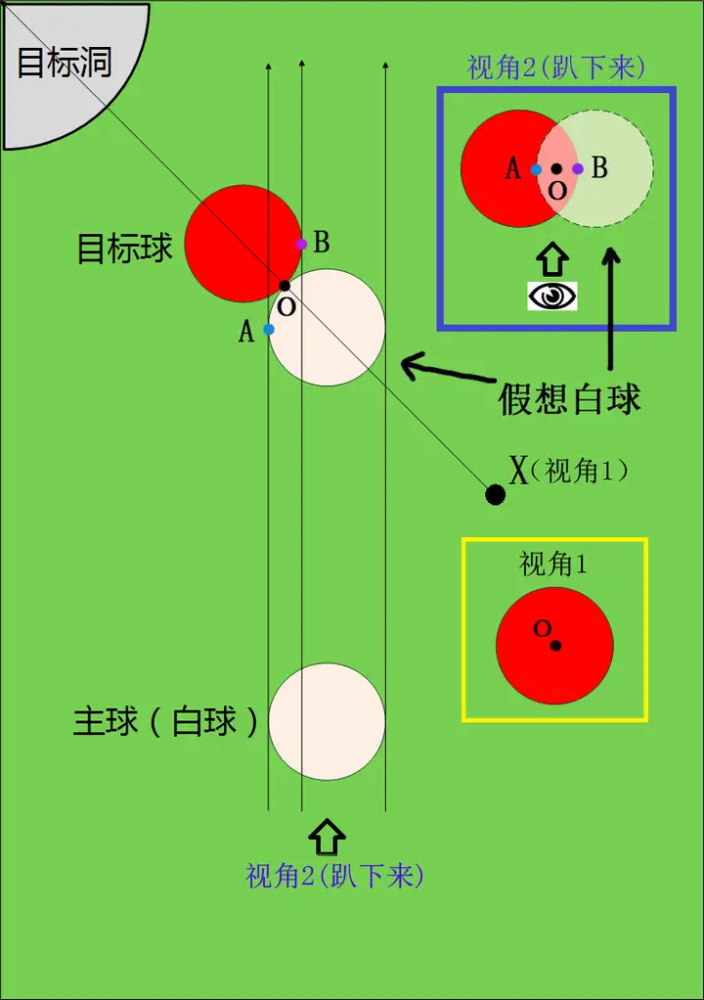

# 技术打法

### 新手涨球必练《半台456》

> https://www.bilibili.com/video/BV1H915YAEU1

### 简单好用的瞄准法

> https://www.zhihu.com/question/19658895/answer/16536895

### 基本杆法及其击球点位

> Alciatore, David G. The Illustrated Principles of Pool and Billiards. Union Square & Co., 2017.

### 投掷效应和齿轮效应

投掷效应（Throw Effect）指的是在击球时，球杆击打白球的某个点，使得白球在接触目标球时会发生偏移。这种偏移主要是由于击球时施加的侧旋和撞击角度的影响。投掷效应会导致目标球的轨迹偏离预期，通常是在击球时用侧旋来改变白球的路径。

齿轮效应（Swerve Effect）是指当白球与目标球碰撞时，由于球的转动和碰撞的角度，目标球的路径会受到影响，导致其产生旋转和偏移。齿轮效应主要体现在击球的力量和旋转的作用上，使得目标球在击出后有一个预期之外的轨迹。

### 半贴库怎么提高进球率

> https://www.bilibili.com/video/BV1BE421K7ic
