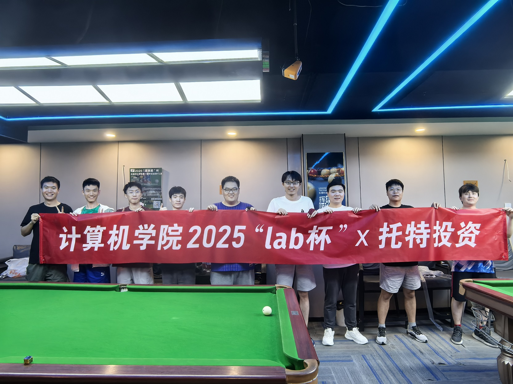
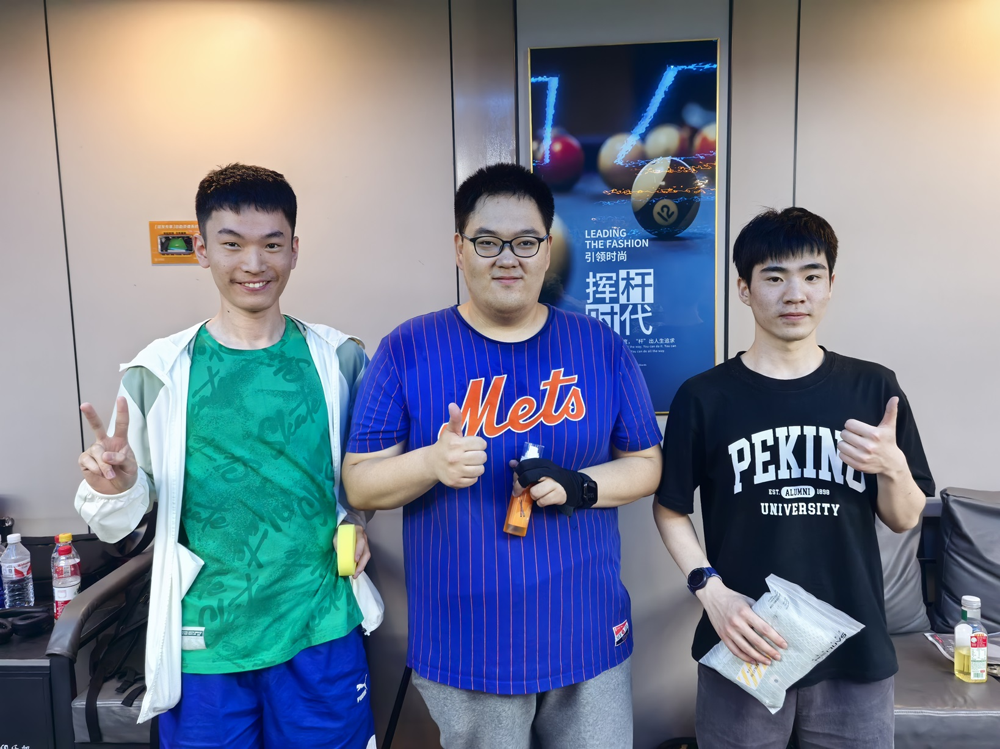
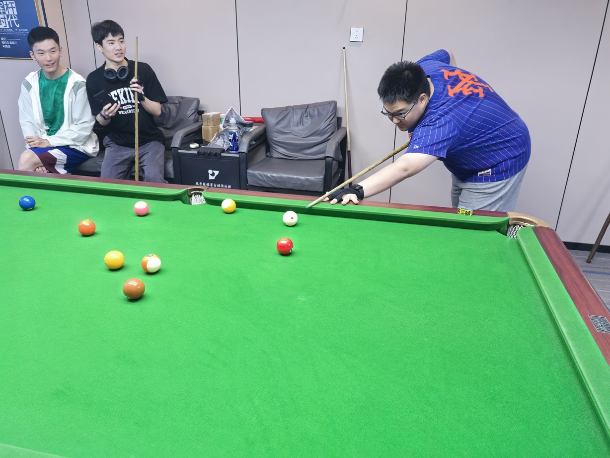
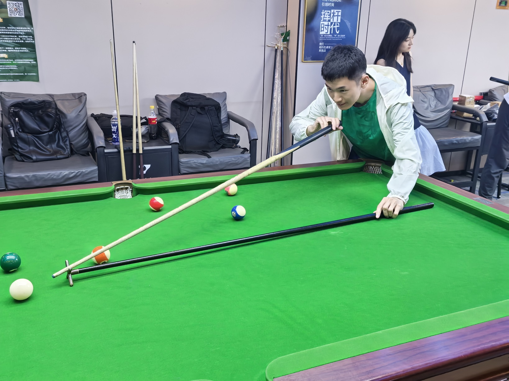
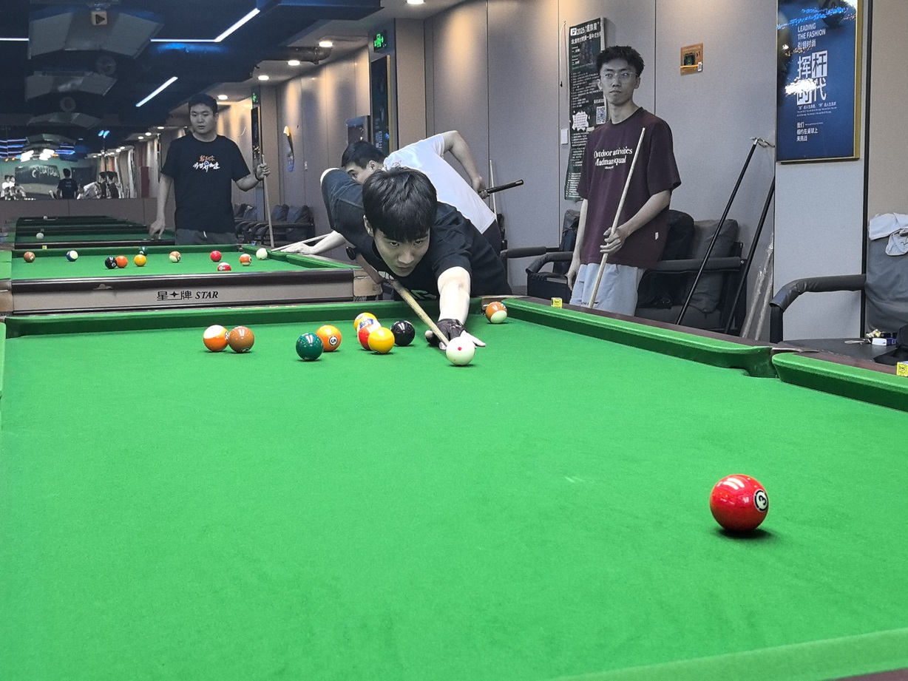

# 2025年学院Lab杯

- 时间：2025年6月15日
- 地点：蓝旗星俱乐部
- 队伍：BOOM队（C队）
- 队员：王翰墨，姜星宇，魏天昊
- 成绩：**季军**
- [比赛集锦](https://www.bilibili.com/video/BV17sMqzgEZD)

## 比赛记录

### 半决赛：C队 0-2 D队

#### 第一盘（单打）：王翰墨 1-2 D队1号

| 局数 | 选手A  |  比分  | 选手B  | 备注  |
| :--: | :----: | :---: | :----: | :---: |
| 1    | 王翰墨 | 8:5   | D队1号 | Final |
| 2    | 王翰墨 | 5:8\* | D队1号 | Final |
| 3    | 王翰墨 | 7:8   | D队1号 | Final |

#### 第二盘（单打）：魏天昊 1-2 D队2号

| 局数 | 选手A  | 比分 | 选手B  | 备注  |
| :--: | :----: | :-: | :----: | :---: |
| 1    | 魏天昊 | 8:6 | D队2号 | Final |
| 2    | 魏天昊 | 7:8 | D队2号 | Final |
| 3    | 魏天昊 | 7:8 | D队2号 | Final |

### 三四名决赛：C队 2-1 B队

#### 第一盘（单打）：姜星宇 0-2 B队1号

| 局数 | 选手A  | 比分 | 选手B  | 备注  |
| :--: | :----: | :-: | :----: | :---: |
| 1    | 姜星宇 | 6:8 | B队1号 | Final |
| 2    | 姜星宇 | 6:8 | B队1号 | Final |

#### 第二盘（单打）：王翰墨 2-0 B队2号

| 局数 | 选手A  |  比分  | 选手B  | 备注  |
| :--: | :----: | :---: | :----: | :---: |
| 1    | 王翰墨 | 8:3    | B队2号 | Final |
| 2    | 王翰墨 | 5:-5\* | B队2号 | Foul  |

#### 第三盘（双打）：王翰墨/魏天昊 2-1 B队1号/B队2号

| 局数 |     选手A     | 比分 |    选手B     | 备注  |
| :--: | :----------: | :-: | :----------: | :---: |
| 1    | 王翰墨/魏天昊 | 8:7 | B队1号/B队2号 | Final |
| 2    | 王翰墨/魏天昊 | 7:8 | B队1号/B队2号 | Final |
| 3    | 王翰墨/魏天昊 | 8:7 | B队1号/B队2号 | Final |

*\* might be inaccurate because of the unclear records*

## 图像资料

