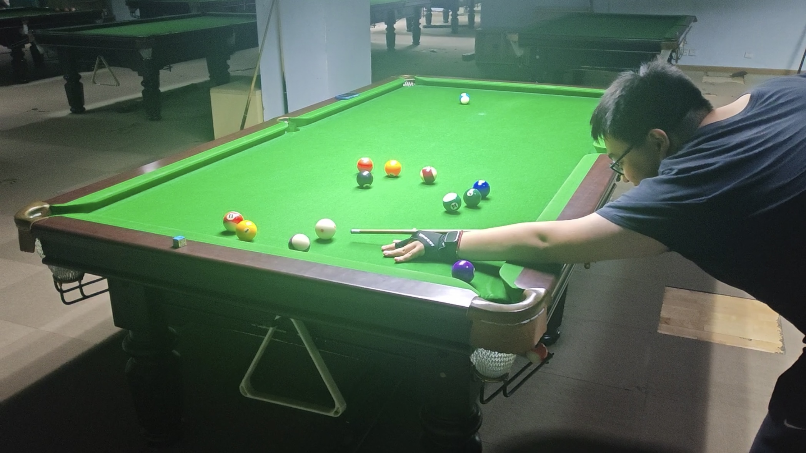
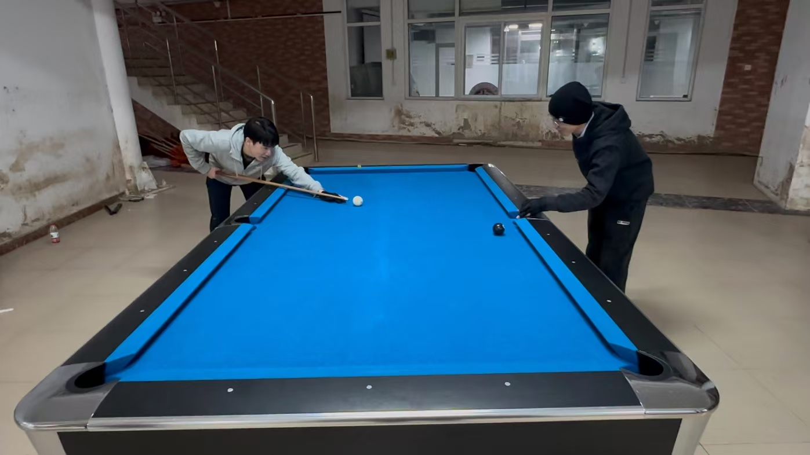
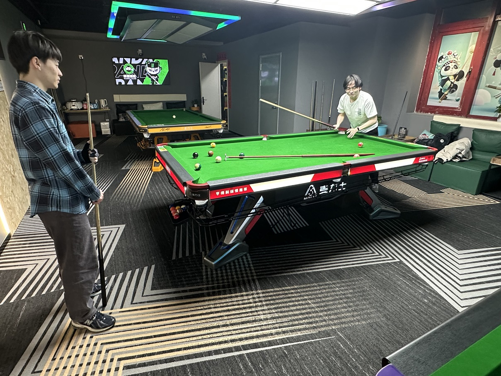
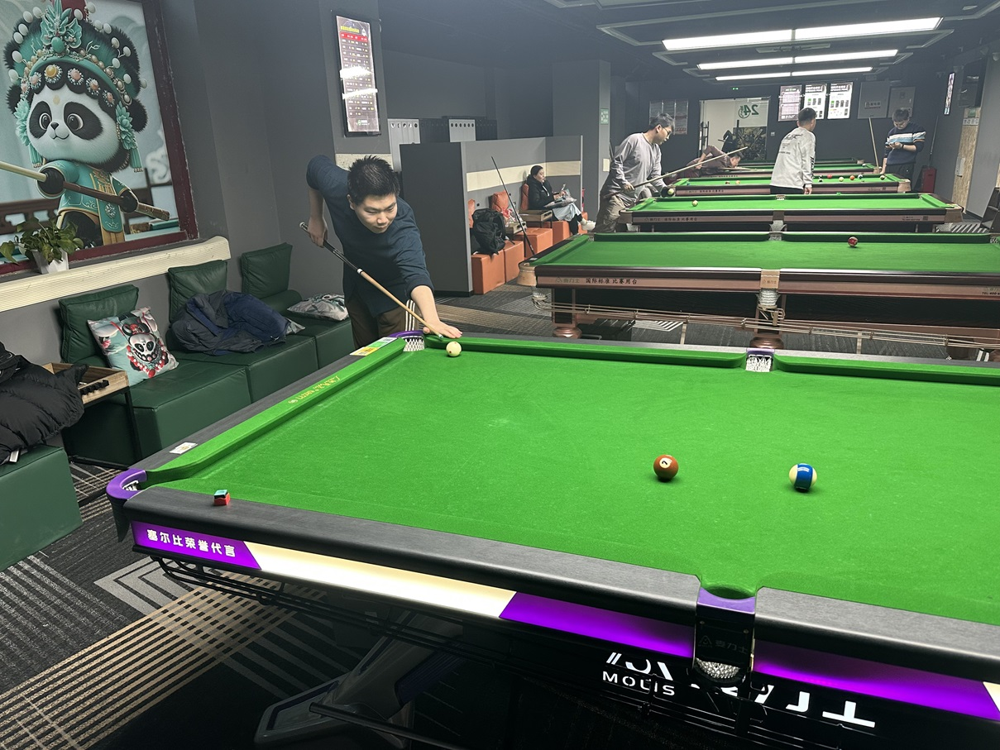

# MPRC台球俱乐部

丰富课余生活，共享台球乐趣！

- **【赛季】** [S5赛季进行中！](./03-统计/1-积分榜.md)
- **【观赛】** [2025年斯诺克世锦赛进行中！](./01-概况/5-观赛专区.md)

<b>Upcoming Matches of World Championship 2025</b>

| 比赛日  |   时间段  |                    选手A                       |                   选手B                        |     轮次      |      阶段     |
| :-----: | :------: | :--------------------------------------------: | :--------------------------------------------: | :----------: | :----------: |
| 4月30日 |   17:00  | 罗尼·奥沙利文(6)  |  斯佳辉(2)           |    1/4决赛    |    第2阶段   |
| 4月30日 |   17:00  |  约翰·希金斯(8)  |  马克·威廉姆斯(8)    |    1/4决赛    |    第3阶段   |
| 4月30日 |   21:30  |     赵心童(12)      |  克里斯·韦克林(4)  |    1/4决赛    |    第3阶段   |
| 4月30日 |   21:30  | 卢卡·布雷切尔(3)  |  贾德·特鲁姆普(5)  |    1/4决赛    |    第2阶段   |
| 5月1日  |   02:00  | 罗尼·奥沙利文(6)  |  斯佳辉(2)           |    1/4决赛    |    第3阶段   |
| 5月1日  |   02:00  | 卢卡·布雷切尔(3)  |  贾德·特鲁姆普(5)  |    1/4决赛    |    第3阶段   |
|         |          |                                                |                                                |              |              |
| 5月1日  |   20:00  |                    W25                         |                     W26                        |    半决赛     |    第1阶段   |
| 5月2日  |   02:00  |                    W27                         |                     W28                        |    半决赛     |    第1阶段   |
|         |          |                                                |                                                |              |              |
| 5月2日  |   17:00  |                    W25                         |                     W26                        |    半决赛     |    第2阶段   |
| 5月2日  |   21:30  |                    W27                         |                     W28                        |    半决赛     |    第2阶段   |
| 5月3日  |   02:00  |                    W25                         |                     W26                        |    半决赛     |    第3阶段   |
|         |          |                                                |                                                |              |              |
| 5月3日  |   17:00  |                    W27                         |                     W28                        |    半决赛     |    第3阶段   |
| 5月3日  |   21:30  |                    W25                         |                     W26                        |    半决赛     |    第4阶段   |
| 5月4日  |   02:00  |                    W27                         |                     W28                        |    半决赛     |    第4阶段   |
|         |          |                                                |                                                |              |              |
| 5月4日  |   20:00  |                    W29                         |                     W30                        |     决赛      |    第1阶段   |
| 5月5日  |   02:00  |                    W29                         |                     W30                        |     决赛      |    第2阶段   |
|         |          |                                                |                                                |              |              |
| 5月5日  |   20:00  |                    W29                         |                     W30                        |     决赛      |    第3阶段   |
| 5月6日  |   02:00  |                    W29                         |                     W30                        |     决赛      |    第4阶段   |

成立时间：2024年10月16日