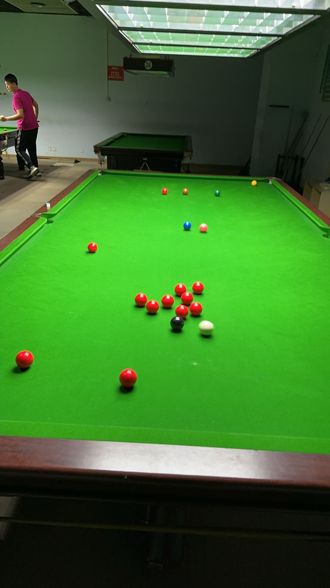

# 英式斯诺克锦标赛/Snooker Championships 147

| 届次 | 日期       | 赛制     | 冠军   | 亚军                   | 季军   | 比分     |
| ---- | ---------- | -------- | ------ | ---------------------- | ------ | -------- |
| 1    | 2024.9.25  | 双人对战 | 王翰墨 | 魏天昊                 | /      | 64-51    |
| 2    | 2024.9.26  | 双人对战 | 王翰墨 | 姜星宇                 | /      | Unknown  |
| 3    | 2024.10.10 | 双人对战 | 王翰墨 | 姜星宇                 | /      | Unknown  |
| 4    | 2024.10.15 | 三人对战 | 姜星宇 | 魏天昊、王翰墨（并列） | /      | 30-30-33 |
| 5    | 2024.10.16 | 三人对战 | 魏天昊 | 姜星宇                 | 王翰墨 | 64-51-73 |

英式斯诺克锦标赛，又称斯诺克147锦标赛，是MPRC台球俱乐部的第一项斯诺克赛事。比赛采用单局制，可2-3人参赛，按得分排定名次。

