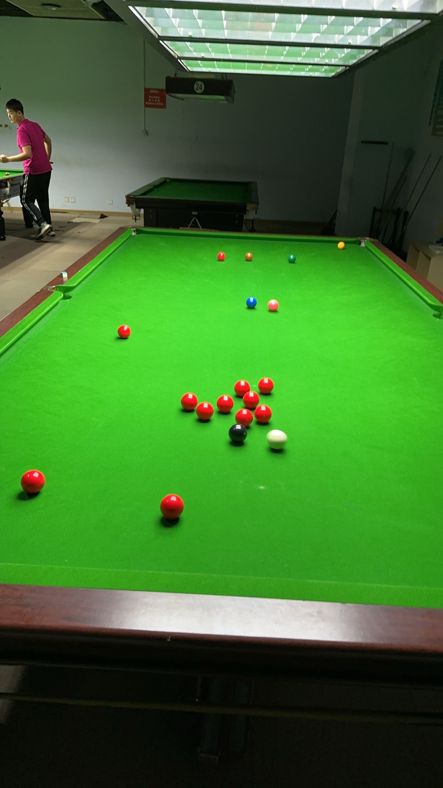

# 英式斯诺克例行赛/Snooker 147 Regular

| 届次 | 日期       | 冠军   | 亚军                   | 季军   | 比分     |
| ---- | ---------- | ------ | ---------------------- | ------ | -------- |
| 1    | 2024.10.15 | 姜星宇 | 魏天昊、王翰墨（并列） | /      | 30-30-33 |
| 2    | 2024.10.16 | 魏天昊 | 姜星宇                 | 王翰墨 | 64-51-73 |

英式斯诺克例行赛，是MPRC台球俱乐部例行的英式斯诺克赛事。比赛采用单局制，3人参赛，循环轮流击球，按得分排定名次。

