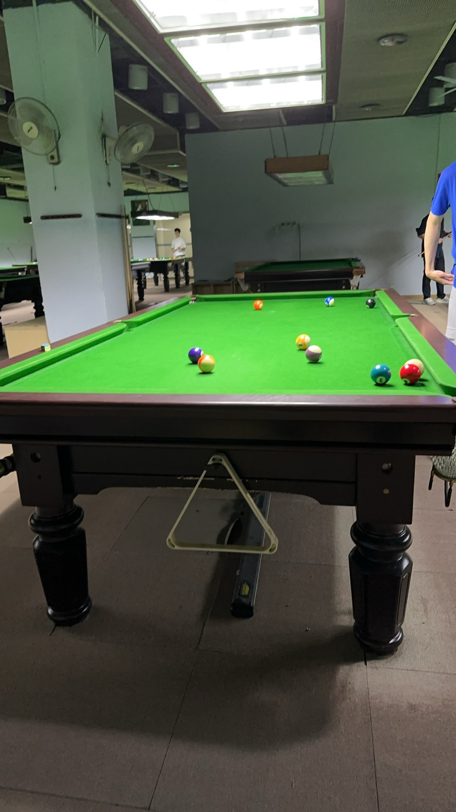

# 邱德拔公开赛/Qiudeba Open

| 届次 | 日期       | 冠军 | 亚军 | 季军 | 决赛比分 |
| ---- | ---------- | ---- | ---- | ---- | -------- |
| 1    | 2024.10.18 |      |      |      |          |

邱德拔公开赛是MPRC台球俱乐部历史最悠久的八球赛事。比赛采用淘汰赛制，抽签决定对阵，直至决出冠军。半决赛采用三局两胜制，决赛采用五局三胜制，季军赛采用单局制。此外，比赛要求至少4名选手参赛。

## 历届赛历

### 第一届

| 编号 | 阶段   | 选手 | 比分 | 选手 | 备注 |
| ---- | ------ | ---- | ---- | ---- | ---- |
| 1    | 半决赛 | A    | 0-0  | D    |      |
| 2    | 半决赛 | B    | 0-0  | C    |      |
| 3    | 季军赛 | L1   | 0-0  | L2   |      |
| 4    | 决赛   | W1   | 0-0  | W2   |      |

